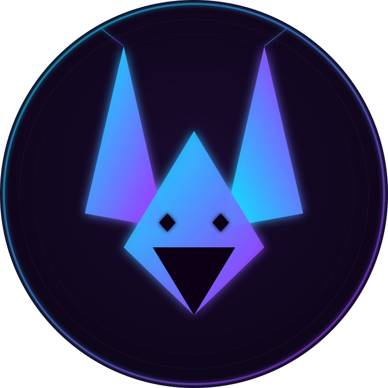

<div align="center">




<a href="https://git.io/typing-svg">
  
</a>

<br/>

[](https://linkedin.com/in/jswalker-data)

</div>

<br/>

## 👾 About Highjackal

```yaml
role: Senior Platform & DevOps Engineer
based_in: London, UK
by_day: "keeping infrastructure alive, automating everything that repeats"
by_night: "building game worlds and the AI tools that power them"
currently:
  - 🏋️  athleteOS — a training/athlete tracking platform
  - 🎮  a Pokémon-themed MCP server (early days, watch this space)
  - 🃏  contributing to TCGdex — open-source Pokémon TCG data
philosophy: "if it can be scripted, it shouldn't be manual"
```

<br/>

## 🛠️ Tech Stack

<div align="center">

**Platform & Infrastructure**


**Languages**


**AI / MCP / Game Dev**


**Data & Tooling**


</div>

<br/>

## 🎮 Featured Projects

<div align="center">

<table>
<tr>
<td width="50%" valign="top">

### 🏋️ athleteOS
Training & performance tracking platform for athletes — built to bring devops-grade reliability to a personal fitness tool

`Claude` `Automation` 

[**→ View repo**](https://github.com/jswalks/Athlete.OS)

</td>
<td width="50%" valign="top">

### 🎮 Pokémon MCP Server
An MCP server that lets AI agents query and act on Pokémon data — early-stage, actively building

`TypeScript` `MCP` `Node.js`

[**→ View repo**](https://github.com/jswalks/pokemon-mcp-server)

</td>
</tr>
<tr>
<td width="50%" valign="top">

### 🃏 TCGdex — Contributor
Contributing card & set data to the open-source Pokémon TCG database that powers apps across the ecosyste

`Open Source` `Data` `TypeScript`

[**→ TCGdex on GitHub**](https://github.com/tcgdex)

</td>
<td width="50%" valign="top">

### ⚔️ Rogue-Like-Game
A roguelike built from scratch — dungeon generation, combat, and progression systems

`Python`

[**→ View repo**](https://github.com/jswalks/Rogue-Like-Game)

</td>
</tr>
<tr>
<td width="50%" valign="top">

### 🗡️ Tamers Gauntlet
A monster catcher and training game written in Python using Tiled

`Python` `Tiled`

[**→ View repo**](https://github.com/jswalks/Tamers_Gauntlet)

</td>
<td width="50%" valign="top">

### 🍽️ Eating Companion
App to help with individuals' eating habits

`Swift` `tbc`

[**→ View repo**](https://github.com/jswalks/eating_companion)

</td>
</tr>
</table>

</div>

<br/>

## ⚙️ Setups & Configs

<div align="center">

<table>
<tr>
<td width="50%" valign="top">

### 🏠 dotfiles
My personal environment setup — shell, terminal, and tool configs

`Shell` `Config`

[**→ View repo**](https://github.com/jswalks/dotfiles)

</td>
<td width="50%" valign="top">

### 💤 LazyVimFork
A personalized fork of LazyVim — tuned to how I actually work

`Lua` `Neovim`

[**→ View repo**](https://github.com/jswalks/LazyVimFork)

</td>
</tr>
</table>

</div>

<br/>

## 📦 Packages

<div align="center">

<table>
<tr>
<td width="100%" valign="top">

### 🎲 dice_roller_rs
Simulator for an RPG dice roller

`Rust`

[](https://crates.io/crates/dice_roller_rs)

[**→ View repo**](https://github.com/jswalks/dice_roller_rs)

</td>
</tr>
</table>

</div>

## 📊 GitHub Stats

<div align="center">


</div>

### 🔥 Contribution Heatmap

<div align="center">


</div>

### 🏆 Trophies

<div align="center">


</div>

<br/>

## 🐍 Contribution Snake

<div align="center">


</div>

<br/>

<div align="center">


</div>

